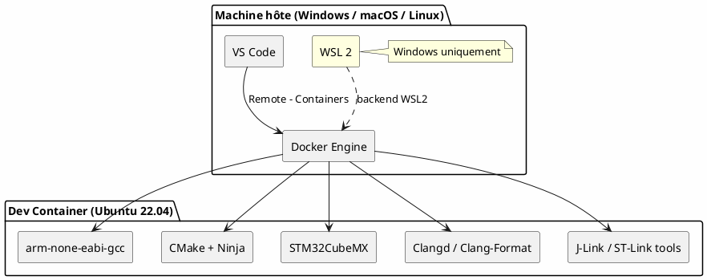

# 1 – Guide d'installation

Ce guide explique comment installer **tous** les outils nécessaires pour travailler sur le STM32 Template, **de zéro**, sur Windows, macOS ou Linux.

> **Temps estimé** : 30 à 60 minutes (selon la connexion Internet).

---

## Table des matières

- [1 – Guide d'installation](#1--guide-dinstallation)
  - [Table des matières](#table-des-matières)
  - [1. Vue d'ensemble](#1-vue-densemble)
  - [2. Windows – Installer WSL](#2-windows--installer-wsl)
    - [2.1 Activer WSL 2](#21-activer-wsl-2)
    - [2.2 Vérifier l'installation](#22-vérifier-linstallation)
    - [2.3 Mettre à jour WSL (si besoin)](#23-mettre-à-jour-wsl-si-besoin)
  - [3. Installer Docker](#3-installer-docker)
    - [Installation (Ubuntu / Debian / WSL)](#installation-ubuntu--debian--wsl)
    - [Démarrer le démon Docker](#démarrer-le-démon-docker)
    - [Vérification](#vérification)
  - [4. Installer VS Code](#4-installer-vs-code)
  - [5. Installer les extensions VS Code](#5-installer-les-extensions-vs-code)
    - [5.1 Extension WSL (Windows uniquement)](#51-extension-wsl-windows-uniquement)
    - [5.2 Extension Dev Containers](#52-extension-dev-containers)
    - [5.3 Extensions installées automatiquement](#53-extensions-installées-automatiquement)
  - [6. Cloner le dépôt](#6-cloner-le-dépôt)
    - [Windows (dans WSL)](#windows-dans-wsl)
    - [macOS / Linux](#macos--linux)
  - [7. Ouvrir le projet dans le Dev Container](#7-ouvrir-le-projet-dans-le-dev-container)
  - [8. USB passthrough (Windows – usbipd)](#8-usb-passthrough-windows--usbipd)
    - [8.1 Installer usbipd-win](#81-installer-usbipd-win)
    - [8.2 Installer le client usbip dans WSL](#82-installer-le-client-usbip-dans-wsl)
    - [8.3 Utilisation – Brancher un ST-Link](#83-utilisation--brancher-un-st-link)
    - [8.4 macOS / Linux natif](#84-macos--linux-natif)
  - [9. Vérification finale](#9-vérification-finale)
  - [10. Résumé des liens](#10-résumé-des-liens)

---

## 1. Vue d'ensemble



Le principe est simple :
1. **VS Code** tourne sur votre machine.
2. Il se connecte à un **conteneur Docker** qui contient *tous* les outils (compilateur, CubeMX, debugger…).
3. Vous n'avez **rien à installer manuellement** dans le conteneur : tout est déjà dans l'image Docker.

---

## 2. Windows – Installer WSL

> **macOS / Linux** : passez directement à la [section 3](#3-installer-docker).

WSL (*Windows Subsystem for Linux*) permet de faire tourner un noyau Linux sous Windows, nécessaire pour Docker.

### 2.1 Activer WSL 2

Ouvrez **PowerShell en tant qu'administrateur** et exécutez :

```powershell
wsl --install
```

Ceci installe WSL 2 avec la distribution Ubuntu par défaut. **Redémarrez** votre PC quand c'est demandé.

> 📖 Documentation complète : <https://learn.microsoft.com/fr-fr/windows/wsl/install>

### 2.2 Vérifier l'installation

Après redémarrage, ouvrez un terminal et tapez :

```powershell
wsl --version
```

Vous devez voir **WSL version: 2.x.x** (ou supérieur).

### 2.3 Mettre à jour WSL (si besoin)

```powershell
wsl --update
```

---

## 3. Installer Docker

Docker est le moteur qui fait tourner le conteneur de développement. On installe **Docker Engine** directement via `apt` (pas de Docker Desktop).

> **Windows** : les commandes ci-dessous s'exécutent **dans le terminal WSL (Ubuntu)**, pas dans PowerShell.
>
> **macOS** : Docker Desktop reste nécessaire sur macOS (pas de WSL). Téléchargez-le depuis <https://docs.docker.com/desktop/install/mac-install/>.

### Installation (Ubuntu / Debian / WSL)

Ouvrez un terminal Ubuntu (ou WSL sur Windows) et exécutez :

```bash
# 1. Pré-requis
sudo apt-get update
sudo apt-get install -y ca-certificates curl

# 2. Ajouter la clé GPG officielle de Docker
sudo install -m 0755 -d /etc/apt/keyrings
sudo curl -fsSL https://download.docker.com/linux/ubuntu/gpg \
    -o /etc/apt/keyrings/docker.asc
sudo chmod a+r /etc/apt/keyrings/docker.asc

# 3. Ajouter le dépôt Docker
echo "deb [arch=$(dpkg --print-architecture) signed-by=/etc/apt/keyrings/docker.asc] \
https://download.docker.com/linux/ubuntu $(. /etc/os-release && echo "$VERSION_CODENAME") stable" \
| sudo tee /etc/apt/sources.list.d/docker.list > /dev/null

# 4. Installer Docker Engine
sudo apt-get update
sudo apt-get install -y docker-ce docker-ce-cli containerd.io docker-compose-plugin

# 5. Ajouter votre utilisateur au groupe docker (évite de taper sudo à chaque fois)
sudo usermod -aG docker $USER
newgrp docker
```

> 📖 Documentation : <https://docs.docker.com/engine/install/ubuntu/>

### Démarrer le démon Docker

Sur un **Linux natif** avec systemd :

```bash
sudo systemctl enable --now docker
```

Dans **WSL** (pas de systemd par défaut sur toutes les versions) :

```bash
# Démarrer Docker manuellement
sudo service docker start

# Pour le démarrer automatiquement à chaque ouverture de WSL,
# ajoutez cette ligne à votre ~/.bashrc :
echo '[ -z "$(pgrep dockerd)" ] && sudo service docker start > /dev/null 2>&1' >> ~/.bashrc
```

> 💡 Depuis WSL 0.67.6+, vous pouvez activer systemd dans WSL en ajoutant `[boot] systemd=true` dans `/etc/wsl.conf`, puis en redémarrant WSL (`wsl --shutdown` dans PowerShell). Dans ce cas, `sudo systemctl enable --now docker` fonctionne normalement.

### Vérification

```bash
docker run hello-world
```

Si vous voyez « Hello from Docker! », c'est bon. ✅

---

## 4. Installer VS Code

Téléchargez VS Code depuis le site officiel : <https://code.visualstudio.com/>

- **Windows** : installez la version **System Installer** (pas User Installer)
- **macOS** : glissez dans Applications
- **Linux** : `.deb` ou via snap (`sudo snap install code --classic`)

> 📖 Documentation : <https://code.visualstudio.com/docs>

---

## 5. Installer les extensions VS Code

Deux extensions doivent être installées **manuellement** sur votre machine hôte (les autres seront installées automatiquement dans le conteneur) :

### 5.1 Extension WSL (Windows uniquement)

Cette extension permet à VS Code de se connecter à WSL.

- **Identifiant** : `ms-vscode-remote.remote-wsl`
- **Installation** : dans VS Code, ouvrez la palette de commandes (`Ctrl+Shift+X`), cherchez « WSL » et installez l'extension de Microsoft.

> 📖 <https://marketplace.visualstudio.com/items?itemName=ms-vscode-remote.remote-wsl>

### 5.2 Extension Dev Containers

Cette extension permet à VS Code d'ouvrir un dossier dans un conteneur Docker.

- **Identifiant** : `ms-vscode-remote.remote-containers`
- **Installation** : cherchez « Dev Containers » dans les extensions et installez.

> 📖 <https://marketplace.visualstudio.com/items?itemName=ms-vscode-remote.remote-containers>

### 5.3 Extensions installées automatiquement

Les extensions suivantes sont déclarées dans `.devcontainer/devcontainer.json` et seront installées **automatiquement** à l'ouverture du conteneur :

| Extension                       | Rôle                               |
| ------------------------------- | ---------------------------------- |
| C/C++ Extension Pack            | IntelliSense, debugging            |
| Cortex-Debug                    | Debug sur cible ARM                |
| Clangd                          | Complétion et analyse statique     |
| CMake IntelliSense              | Support CMake                      |
| Git Graph / GitLens             | Historique Git                     |
| Markdown All in One             | Édition Markdown                   |
| Markdown Preview Enhanced       | Prévisualisation avancée           |
| PlantUML                        | Diagrammes UML                     |
| Serial Monitor                  | Communication série                |
| Doxygen Documentation Generator | Génération de commentaires Doxygen |
| Hex Editor                      | Visualisation de binaires          |

---

## 6. Cloner le dépôt

### Windows (dans WSL)

Ouvrez un terminal **Ubuntu (WSL)** :

```bash
cd ~
git clone <URL_DU_DEPOT> stm32template
```

> ⚠️ **Important** : Clonez le dépôt **dans le filesystem WSL** (par exemple `~/stm32template`), **pas** dans `/mnt/c/...`. Les performances sont bien meilleures.

### macOS / Linux

```bash
cd ~
git clone <URL_DU_DEPOT> stm32template
```

---

## 7. Ouvrir le projet dans le Dev Container

1. Ouvrez **VS Code**
2. **Windows** : connectez-vous d'abord à WSL (`Ctrl+Shift+P` → « WSL: Connect to WSL »)
3. Ouvrez le dossier du projet (`Ctrl+K Ctrl+O` → sélectionnez `~/stm32template`)
4. VS Code détecte le fichier `.devcontainer/devcontainer.json` et propose :
   > **« Reopen in Container »** → **Cliquez dessus**
5. Attendez que l'image Docker soit téléchargée et le conteneur démarré (quelques minutes la première fois)

Alternativement, utilisez la palette de commandes :
- `Ctrl+Shift+P` → **« Dev Containers: Reopen in Container »**

> 💡 La première ouverture télécharge l'image Docker (~6 Go). Les ouvertures suivantes sont quasi-instantanées.

---

## 8. USB passthrough (Windows – usbipd)

Pour flasher et débugger la carte STM32 depuis le conteneur Docker (qui tourne dans WSL), il faut « passer » le périphérique USB (ST-Link / J-Link) de Windows vers WSL.

### 8.1 Installer usbipd-win

Téléchargez le `.msi` depuis : <https://github.com/dorssel/usbipd-win/releases>

Ou via winget :

```powershell
winget install usbipd
```

> 📖 Documentation : <https://learn.microsoft.com/fr-fr/windows/wsl/connect-usb>

### 8.2 Installer le client usbip dans WSL

Dans un terminal WSL (Ubuntu) :

```bash
sudo apt install linux-tools-generic hwdata
sudo update-alternatives --install /usr/local/bin/usbip usbip \
    /usr/lib/linux-tools/*-generic/usbip 20
```

### 8.3 Utilisation – Brancher un ST-Link

1. Branchez votre sonde de debug (ST-Link, J-Link…)
2. Dans **PowerShell (Admin)** :

```powershell
# Lister les périphériques USB
usbipd list

# Attacher le ST-Link à WSL (remplacer BUSID par le bon, ex: 1-3)
usbipd bind --busid <BUSID>
usbipd attach --wsl --busid <BUSID>
```

3. Vérifiez dans WSL :

```bash
lsusb
# Vous devez voir votre sonde (ex: STMicroelectronics ST-LINK/V2.1)
```

> 💡 **Astuce** : La commande `usbipd attach` doit être relancée à chaque débranchement/rebranchement du câble USB.

### 8.4 macOS / Linux natif

Le périphérique USB est directement visible. Le `devcontainer.json` monte déjà `/dev` dans le conteneur :

```json
"mounts": [
    "source=/dev,target=/dev,type=bind,consistency=cached"
]
```

Aucune configuration supplémentaire n'est nécessaire.

---

## 9. Vérification finale

Une fois dans le conteneur (terminal VS Code), vérifiez que tout fonctionne :

```bash
# Vérifier le compilateur
arm-none-eabi-gcc --version

# Vérifier CMake
cmake --version

# Vérifier Ninja
ninja --version

# Vérifier CubeMX
STM32CubeMX -h 2>&1 | head -3

# Compiler le projet
cmake --preset template_g431
cmake --build build/template_g431
```

Si la compilation se termine sans erreur et affiche les tailles mémoire (RAM / FLASH), tout est opérationnel ! 🎉

---

## 10. Résumé des liens

| Outil                        | Lien                                                                                     |
| ---------------------------- | ---------------------------------------------------------------------------------------- |
| WSL                          | <https://learn.microsoft.com/fr-fr/windows/wsl/install>                                  |
| Docker Engine (apt)          | <https://docs.docker.com/engine/install/ubuntu/>                                         |
| VS Code                      | <https://code.visualstudio.com/>                                                         |
| Extension WSL                | <https://marketplace.visualstudio.com/items?itemName=ms-vscode-remote.remote-wsl>        |
| Extension Dev Containers     | <https://marketplace.visualstudio.com/items?itemName=ms-vscode-remote.remote-containers> |
| usbipd-win                   | <https://github.com/dorssel/usbipd-win/releases>                                         |
| USB dans WSL (doc Microsoft) | <https://learn.microsoft.com/fr-fr/windows/wsl/connect-usb>                              |
| arm-none-eabi-gcc            | <https://developer.arm.com/Tools%20and%20Software/GNU%20Toolchain>                       |
| STM32CubeMX                  | <https://www.st.com/en/development-tools/stm32cubemx.html>                               |
| CMake                        | <https://cmake.org/documentation/>                                                       |

---

➡️ **Étape suivante** : [Utilisation du projet](02-utilisation.md)
