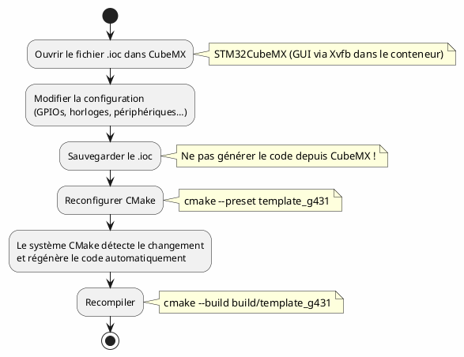
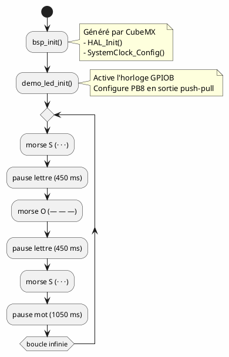

# 2 – Guide d'utilisation

Ce guide explique le workflow quotidien : compiler, flasher, débugger et modifier la configuration matérielle.

---

## Table des matières

1. [Compiler le projet](#1-compiler-le-projet)
2. [Flasher la carte](#2-flasher-la-carte)
3. [Débugger](#3-débugger)
4. [Modifier la configuration CubeMX](#4-modifier-la-configuration-cubemx)
5. [Ajouter des fichiers sources](#5-ajouter-des-fichiers-sources)
6. [Comprendre le code de démo](#6-comprendre-le-code-de-démo)
7. [Moniteur série](#7-moniteur-série)
8. [Commandes utiles](#8-commandes-utiles)

---

## 1. Compiler le projet

### Depuis le terminal (dans le conteneur)

```bash
# Configuration (une seule fois, ou après modification du CMakeLists.txt)
cmake --preset template_g431

# Compilation
cmake --build build/template_g431
```

### Depuis VS Code

1. Utilisez la commande CMake de la palette : `Ctrl+Shift+P` → **« CMake: Configure »**
2. Sélectionnez le preset **`template_g431`**
3. Compilez avec `Ctrl+Shift+B` ou `Ctrl+Shift+P` → **« CMake: Build »**

### Sortie attendue

```
[19/19] Linking C executable bin/template_g431
Memory region         Used Size  Region Size  %age Used
             RAM:        2064 B        32 KB      6.30%
           FLASH:       26736 B       128 KB     20.40%
```

Le binaire est généré dans `build/template_g431/bin/template_g431`.

---

## 2. Flasher la carte

### Avec STM32CubeProgrammer (ST-Link)

```bash
STM32_Programmer_CLI -c port=SWD -w build/template_g431/bin/template_g431.bin 0x08000000 -v -rst
```

### Avec J-Link

```bash
# Créer un script de flash
cat > /tmp/flash.jlink << EOF
device STM32G431KB
si SWD
speed 4000
connect
loadfile build/template_g431/bin/template_g431.hex
r
g
exit
EOF

JLinkExe -CommandFile /tmp/flash.jlink
```

### Avec OpenOCD (alternative)

```bash
openocd -f interface/stlink.cfg -f target/stm32g4x.cfg \
    -c "program build/template_g431/bin/template_g431.bin 0x08000000 verify reset exit"
```

---

## 3. Débugger

### Configuration Cortex-Debug

Créez (ou vérifiez) le fichier `.vscode/launch.json` :

```json
{
    "version": "0.2.0",
    "configurations": [
        {
            "name": "Debug (ST-Link)",
            "type": "cortex-debug",
            "request": "launch",
            "servertype": "stlink",
            "executable": "${workspaceFolder}/build/template_g431/bin/template_g431",
            "device": "STM32G431KB",
            "runToEntryPoint": "main",
            "svdFile": "${workspaceFolder}/build/template_g431/drivers/template_g431/Drivers/CMSIS/Device/ST/STM32G4xx/SVD/STM32G431xx.svd"
        },
        {
            "name": "Debug (J-Link)",
            "type": "cortex-debug",
            "request": "launch",
            "servertype": "jlink",
            "executable": "${workspaceFolder}/build/template_g431/bin/template_g431",
            "device": "STM32G431KB",
            "interface": "swd",
            "runToEntryPoint": "main"
        }
    ]
}
```

### Lancer le debug

1. Branchez votre sonde (ST-Link ou J-Link)
2. Windows : n'oubliez pas `usbipd attach` (voir [guide d'installation](01-installation.md#8-usb-passthrough-windows--usbipd))
3. `F5` dans VS Code → sélectionnez la configuration appropriée
4. Le programme s'arrête sur `main()` → utilisez les contrôles habituels (F10 = step over, F11 = step into, F5 = continue)

---

## 4. Modifier la configuration CubeMX

Le fichier `.ioc` de configuration CubeMX se trouve dans :

```
src/bsp/template_g431/template_g431.ioc
```

### Workflow



### Depuis le terminal

```bash
# Ouvrir CubeMX en mode graphique (nécessite un serveur X ou Xvfb)
STM32CubeMX src/bsp/template_g431/template_g431.ioc
```

### Points importants

- **Ne générez PAS le code depuis CubeMX** : le système CMake s'en charge automatiquement via `cubemx.cmake`.
- Modifiez **uniquement** le fichier `.ioc` dans `src/bsp/`.
- Le code généré est placé dans `build/` et n'est **jamais versionné** dans Git.
- La fonction `main()` générée par CubeMX est automatiquement renommée en `bsp_init()` par le script CMake.

---

## 5. Ajouter des fichiers sources

### Fichier source simple (toujours compilé)

Dans `CMakeLists.txt`, ajoutez :

```cmake
add_src("src/mon_module.c")
```

### Fichier conditionnel (selon la variante)

```cmake
# Compilé uniquement si la variante "stm32g431" est active
add_src(stm32g431 "src/drivers/mon_driver_g431.c")

# Compilé pour toutes les variantes STM32
add_src(stm32 "src/hal_wrapper.c")
```

### Organisation recommandée

```
src/
├── main.c                  # Point d'entrée
├── app/                    # Logique applicative
│   ├── app.c
│   └── app.h
├── drivers/                # Drivers spécifiques
│   └── led.c
└── bsp/                    # Board Support Packages (fichiers .ioc)
    └── template_g431/
        └── template_g431.ioc
```

---

## 6. Comprendre le code de démo

Le fichier `src/main.c` contient un code de démonstration qui fait clignoter la LED utilisateur (PB8) de la carte Nucleo-G431KB en **morse SOS**.

### Séquence

| Lettre | Morse   | LED                             |
| ------ | ------- | ------------------------------- |
| S      | `· · ·` | 3 clignotements courts (150 ms) |
| O      | `— — —` | 3 clignotements longs (450 ms)  |
| S      | `· · ·` | 3 clignotements courts (150 ms) |

Puis une pause de 1050 ms, et ça recommence.

### Flux d'exécution



---

## 7. Moniteur série

Si vous configurez un UART dans CubeMX, vous pouvez utiliser le moniteur série intégré à VS Code :

1. Extension **Serial Monitor** (installée automatiquement)
2. `Ctrl+Shift+P` → **« Serial Monitor: Open »**
3. Sélectionnez le port série (ex: `/dev/ttyACM0`)
4. Configurez le baud rate (ex: 115200)

---

## 8. Commandes utiles

| Action                  | Commande                                                             |
| ----------------------- | -------------------------------------------------------------------- |
| Configurer              | `cmake --preset template_g431`                                       |
| Compiler                | `cmake --build build/template_g431`                                  |
| Nettoyer                | `rm -rf build/template_g431`                                         |
| Reconfigurer proprement | `rm -rf build/template_g431 && cmake --preset template_g431`         |
| Taille du binaire       | `arm-none-eabi-size build/template_g431/bin/template_g431`           |
| Désassembler            | `arm-none-eabi-objdump -d build/template_g431/bin/template_g431`     |
| Voir les symboles       | `arm-none-eabi-nm --size-sort build/template_g431/bin/template_g431` |

---

➡️ **Étape suivante** : [Architecture du projet](03-architecture.md)
