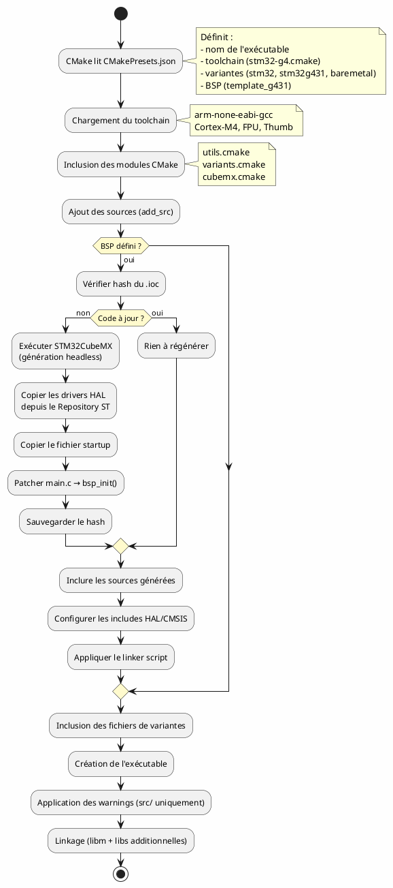
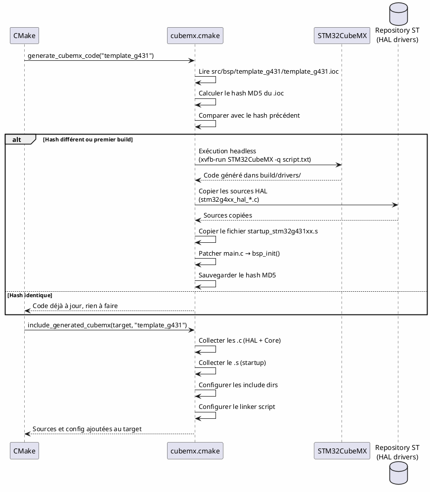
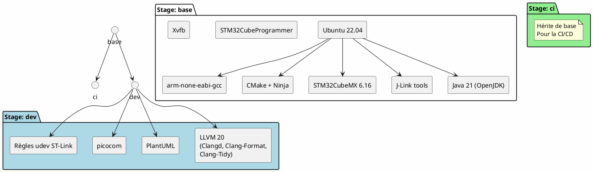

# 3 – Architecture du projet

Ce document décrit la structure du projet, le système de build CMake et l'intégration de STM32CubeMX.

---

## Table des matières

1. [Arborescence du projet](#1-arborescence-du-projet)
2. [Flux de build CMake](#2-flux-de-build-cmake)
3. [Système de presets](#3-système-de-presets)
4. [Système de variantes](#4-système-de-variantes)
5. [Intégration CubeMX](#5-intégration-cubemx)
6. [Toolchain cross-compilation](#6-toolchain-cross-compilation)
7. [Image Docker](#7-image-docker)
8. [Dev Container](#8-dev-container)

---

## 1. Arborescence du projet

```
stm32template/
├── .devcontainer/
│   └── devcontainer.json        # Configuration du conteneur de dev
├── cmake/
│   ├── local.cmake.sample       # Config locale (non versionnée)
│   ├── modules/
│   │   ├── cubemx.cmake         # Intégration STM32CubeMX
│   │   ├── utils.cmake          # Macros utilitaires (add_src, etc.)
│   │   ├── variants.cmake       # Déclaration des variantes disponibles
│   │   └── variants/
│   │       └── stm32g431.cmake  # Config spécifique au STM32G431
│   └── toolchains/
│       └── stm32-g4.cmake       # Toolchain ARM Cortex-M4 (G4)
├── docker/
│   ├── build.sh                 # Script de build de l'image Docker
│   ├── Dockerfile               # Définition de l'image (multi-stage)
│   └── entrypoint.sh            # Script d'entrée du conteneur
├── docs/                        # Cette documentation
├── src/
│   ├── main.c                   # Point d'entrée de l'application
│   └── bsp/
│       └── template_g431/
│           └── template_g431.ioc  # Configuration CubeMX
├── build/                       # Dossier de build (généré, non versionné)
│   └── template_g431/
│       ├── bin/
│       │   └── template_g431    # Binaire ELF final
│       └── drivers/
│           └── template_g431/   # Code généré par CubeMX
├── CMakeLists.txt               # Configuration CMake principale
├── CMakePresets.json             # Presets de build
├── LICENSE                      # Licence MIT
└── README.md
```

---

## 2. Flux de build CMake

Le processus de build suit ce flux :



---

## 3. Système de presets

Le fichier `CMakePresets.json` définit les configurations de build. Chaque preset correspond à une cible matérielle.

```json
{
    "name": "template_g431",
    "inherits": "default_preset",
    "toolchainFile": "cmake/toolchains/stm32-g4.cmake",
    "cacheVariables": {
        "STM32_BASE_VARIANTS": "stm32;stm32g431;baremetal",
        "STM32_BSP_NAME": "template_g431"
    }
}
```

| Variable              | Rôle                                           |
| --------------------- | ---------------------------------------------- |
| `EXECUTABLE_NAME`     | Nom du binaire de sortie (= nom du preset)     |
| `STM32_BASE_VARIANTS` | Liste de variantes activées (séparées par `;`) |
| `STM32_BSP_NAME`      | Nom du BSP CubeMX à utiliser                   |
| `toolchainFile`       | Fichier de toolchain cross-compilation         |

---

## 4. Système de variantes

Les variantes permettent d'inclure conditionnellement du code source selon la cible.

### Variantes disponibles

Déclarées dans `cmake/modules/variants.cmake` :

| Variante    | Description                  |
| ----------- | ---------------------------- |
| `stm32`     | Code commun à tous les STM32 |
| `stm32g431` | Code spécifique au STM32G431 |
| `baremetal` | Code bare-metal (sans OS)    |

### Usage dans CMakeLists.txt

```cmake
# Toujours compilé
add_src("src/main.c")

# Compilé seulement si la variante "stm32" est active
add_src(stm32 "src/hal_wrapper.c")

# Compilé seulement si la variante "stm32g431" est active
add_src(stm32g431 "src/g431_specific.c")
```

### Fichiers de variantes

Chaque variante peut avoir un fichier `.cmake` associé dans `cmake/modules/variants/` :
- `stm32g431.cmake` : exécuté **avant** la création de l'exécutable (ajout de sources/defines)
- `stm32g431_post.cmake` : exécuté **après** (configuration du linkage, etc.)

---

## 5. Intégration CubeMX

Le module `cmake/modules/cubemx.cmake` gère automatiquement la génération du code CubeMX. C'est le cœur du système.

### Processus détaillé



### Points clés

- Le `.ioc` est la **seule source de vérité** pour la configuration matérielle
- Le code généré vit dans `build/` et n'est **jamais commité**
- La régénération est **incrémentale** : basée sur le hash MD5 du `.ioc`
- `main()` de CubeMX est renommé en `bsp_init()` pour ne pas confliter avec le `main()` applicatif

---

## 6. Toolchain cross-compilation

Le fichier `cmake/toolchains/stm32-g4.cmake` configure la chaîne de compilation pour le Cortex-M4 :

| Paramètre          | Valeur                                                  |
| ------------------ | ------------------------------------------------------- |
| Compilateur C      | `arm-none-eabi-gcc`                                     |
| Compilateur C++    | `arm-none-eabi-g++`                                     |
| Assembleur         | `arm-none-eabi-gcc`                                     |
| Architecture       | Cortex-M4 (`-mcpu=cortex-m4`)                           |
| Jeu d'instructions | Thumb (`-mthumb`)                                       |
| FPU                | Simple précision (`-mfpu=fpv4-sp-d16 -mfloat-abi=hard`) |
| Optimisation       | Sections (`-ffunction-sections -fdata-sections`)        |
| Linker             | `nano.specs`, `nosys.specs`, `--gc-sections`            |

### Warnings stricts (code applicatif uniquement)

Le `CMakeLists.txt` applique des warnings stricts **uniquement** aux fichiers dans `src/` et `tests/`, pas au code généré par CubeMX ni aux drivers HAL :

- `-Wall -Wextra -Werror`
- `-Wshadow -Wconversion -Wsign-conversion`
- `-Wstrict-prototypes -Wmissing-prototypes` (C uniquement)
- `-Wnull-dereference -Wdouble-promotion`
- `-fstack-protector-strong`

---

## 7. Image Docker

Le `Dockerfile` est **multi-stage** :



| Stage  | Usage                                     | Taille approx. |
| ------ | ----------------------------------------- | -------------- |
| `base` | Outils de build essentiels                | ~4 Go          |
| `ci`   | Pour les pipelines CI/CD                  | ~4 Go          |
| `dev`  | Développement complet (Clangd, PlantUML…) | ~6 Go          |

### Build multi-architecture

Le script `docker/build.sh` supporte les architectures `amd64` et `arm64` (Apple Silicon) via `docker buildx`.

---

## 8. Dev Container

Le fichier `.devcontainer/devcontainer.json` configure l'environnement VS Code :

### Image

```json
"image": "ghcr.io/cmenard001/stm32template:dev"
```

### Extensions installées automatiquement

Les extensions listées dans le `devcontainer.json` sont installées au démarrage du conteneur (voir [guide d'installation](01-installation.md#53-extensions-installées-automatiquement)).

### Montages

| Source            | Destination              | Rôle                      |
| ----------------- | ------------------------ | ------------------------- |
| Dossier du projet | `/home/dev/<nom_projet>` | Code source               |
| `/dev` (hôte)     | `/dev` (conteneur)       | Accès USB (ST-Link, etc.) |
| `~/.ssh` (hôte)   | `/home/dev/.ssh`         | Clés SSH pour Git         |

---

➡️ **Étape suivante** : [Ajouter une cible](04-ajouter-une-cible.md)
