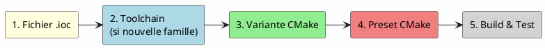

# 4 – Ajouter une nouvelle cible

Ce guide explique comment adapter le projet pour une carte ou un MCU STM32 différent du STM32G431KB d'origine.

---

## Table des matières

1. [Vue d'ensemble](#1-vue-densemble)
2. [Étape 1 – Créer le fichier .ioc](#étape-1--créer-le-fichier-ioc)
3. [Étape 2 – Créer le toolchain](#étape-2--créer-le-toolchain-si-nécessaire)
4. [Étape 3 – Déclarer la variante](#étape-3--déclarer-la-variante)
5. [Étape 4 – Ajouter le preset](#étape-4--ajouter-le-preset)
6. [Étape 5 – Compiler et tester](#étape-5--compiler-et-tester)
7. [Exemple complet : STM32F411RE](#exemple-complet--stm32f411re)
8. [Vérifier le Repository ST](#vérifier-le-repository-st)

---

## 1. Vue d'ensemble



Tout dépend de si votre MCU appartient à une **famille déjà supportée** ou non :

| Cas                            | Étapes nécessaires |
| ------------------------------ | ------------------ |
| Même famille (ex: STM32G4)     | 1 → 4 → 5          |
| Nouvelle famille (ex: STM32F4) | 1 → 2 → 3 → 4 → 5  |

---

## Étape 1 – Créer le fichier .ioc

1. Ouvrez STM32CubeMX
2. Créez un nouveau projet pour votre MCU / carte
3. Configurez vos périphériques (horloge, GPIOs, UART, etc.)
4. **Important** : dans Project Manager, réglez :
   - **Toolchain / IDE** : `Makefile`
   - **Project Name** : le nom de votre BSP (ex: `nucleo_f411`)
5. **Sauvegardez** le `.ioc` (sans générer le code !)
6. Placez-le dans `src/bsp/<nom_du_bsp>/` :

```bash
mkdir -p src/bsp/nucleo_f411
# Copiez/déplacez le .ioc ici :
cp ~/nucleo_f411.ioc src/bsp/nucleo_f411/nucleo_f411.ioc
```

> ⚠️ Le nom du dossier **doit** correspondre au nom du fichier `.ioc` (sans l'extension).

---

## Étape 2 – Créer le toolchain (si nécessaire)

Si votre MCU appartient à une **nouvelle famille** (ex: passage du G4 au F4), créez un fichier toolchain.

Copiez le toolchain existant et adaptez-le :

```bash
cp cmake/toolchains/stm32-g4.cmake cmake/toolchains/stm32-f4.cmake
```

Éditez `stm32-f4.cmake` et modifiez :

```cmake
# Adapter le CPU (ici Cortex-M4 aussi pour le F4, mais changez si nécessaire)
set(CMAKE_C_FLAGS_INIT
    "-mcpu=cortex-m4 -mthumb -mfpu=fpv4-sp-d16 -mfloat-abi=hard -ffunction-sections -fdata-sections"
)

# Adapter la définition du MCU
add_definitions(-DSTM32F4)
add_definitions(-DUSE_HAL_DRIVER)
```

### Correspondance CPU/MCU courante

| Famille STM32 | Cœur ARM   | -mcpu        | FPU                 |
| ------------- | ---------- | ------------ | ------------------- |
| STM32F0       | Cortex-M0  | `cortex-m0`  | Pas de FPU          |
| STM32F1       | Cortex-M3  | `cortex-m3`  | Pas de FPU          |
| STM32F4       | Cortex-M4  | `cortex-m4`  | `-mfpu=fpv4-sp-d16` |
| STM32G4       | Cortex-M4  | `cortex-m4`  | `-mfpu=fpv4-sp-d16` |
| STM32F7       | Cortex-M7  | `cortex-m7`  | `-mfpu=fpv5-d16`    |
| STM32H7       | Cortex-M7  | `cortex-m7`  | `-mfpu=fpv5-d16`    |
| STM32L4       | Cortex-M4  | `cortex-m4`  | `-mfpu=fpv4-sp-d16` |
| STM32U5       | Cortex-M33 | `cortex-m33` | `-mfpu=fpv5-sp-d16` |

> 📖 Référence : [ARM Cortex-M Processor Comparison](https://developer.arm.com/Processors/Cortex-M4)

---

## Étape 3 – Déclarer la variante

### 3.1 Ajouter à la liste des variantes disponibles

Éditez `cmake/modules/variants.cmake` :

```cmake
set(STM32_AVAILABLE_VARIANTS
    # OS
    baremetal

    # Chips
    stm32g431
    stm32f411     # ← Ajouter ici
    stm32
)
```

### 3.2 Créer le fichier de variante (optionnel)

Si votre cible nécessite une configuration spécifique (include paths, defines, sources supplémentaires), créez :

```bash
touch cmake/modules/variants/stm32f411.cmake
```

Exemple de contenu :

```cmake
# cmake/modules/variants/stm32f411.cmake
# Configuration spécifique au STM32F411

# Ajouter des sources conditionnelles
# add_src(stm32f411 "src/drivers/f411_specific.c")
```

---

## Étape 4 – Ajouter le preset

Éditez `CMakePresets.json` et ajoutez un nouveau preset :

```json
{
    "name": "nucleo_f411",
    "inherits": "default_preset",
    "toolchainFile": "${sourceDir}/cmake/toolchains/stm32-f4.cmake",
    "cacheVariables": {
        "STM32_BASE_VARIANTS": "stm32;stm32f411;baremetal",
        "STM32_BSP_NAME": "nucleo_f411"
    }
}
```

### Explication des champs

| Champ                 | Valeur                      | Description                                         |
| --------------------- | --------------------------- | --------------------------------------------------- |
| `name`                | `nucleo_f411`               | Nom unique du preset (= nom de l'exécutable)        |
| `toolchainFile`       | `stm32-f4.cmake`            | Toolchain de la famille STM32                       |
| `STM32_BASE_VARIANTS` | `stm32;stm32f411;baremetal` | Variantes à activer                                 |
| `STM32_BSP_NAME`      | `nucleo_f411`               | Doit correspondre au nom du dossier dans `src/bsp/` |

---

## Étape 5 – Compiler et tester

```bash
# Configurer
cmake --preset nucleo_f411

# Compiler
cmake --build build/nucleo_f411

# Vérifier la taille
arm-none-eabi-size build/nucleo_f411/bin/nucleo_f411
```

---

## Exemple complet : STM32F411RE

Récapitulatif de l'arborescence après ajout :

```
stm32template/
├── cmake/
│   ├── modules/
│   │   ├── variants.cmake           # stm32f411 ajouté à la liste
│   │   └── variants/
│   │       ├── stm32g431.cmake
│   │       └── stm32f411.cmake      # ← Nouveau (peut être vide)
│   └── toolchains/
│       ├── stm32-g4.cmake
│       └── stm32-f4.cmake           # ← Nouveau
├── src/
│   └── bsp/
│       ├── template_g431/
│       │   └── template_g431.ioc
│       └── nucleo_f411/              # ← Nouveau
│           └── nucleo_f411.ioc
├── CMakePresets.json                 # nucleo_f411 preset ajouté
└── ...
```

---

## Vérifier le Repository ST

Le système de build copie les drivers HAL depuis le Repository ST installé dans le conteneur Docker (`~/STM32Cube/Repository`).

Vérifiez que le firmware pack de votre famille est présent :

```bash
ls ~/STM32Cube/Repository/
```

Si le pack de votre famille manque, vous pouvez le télécharger via CubeMX ou l'ajouter au `Dockerfile` :

```dockerfile
# Exemple pour la famille F4
RUN mkdir -p /opt/st/Repository/STM32Cube_FW_F4_V1.28.0
# ... ou téléchargement via CubeMX au premier configure
```

> 💡 Normalement, CubeMX télécharge automatiquement le firmware pack nécessaire lors de la première génération de code.

---

➡️ **Étape suivante** : [FAQ & Dépannage](05-faq.md)
